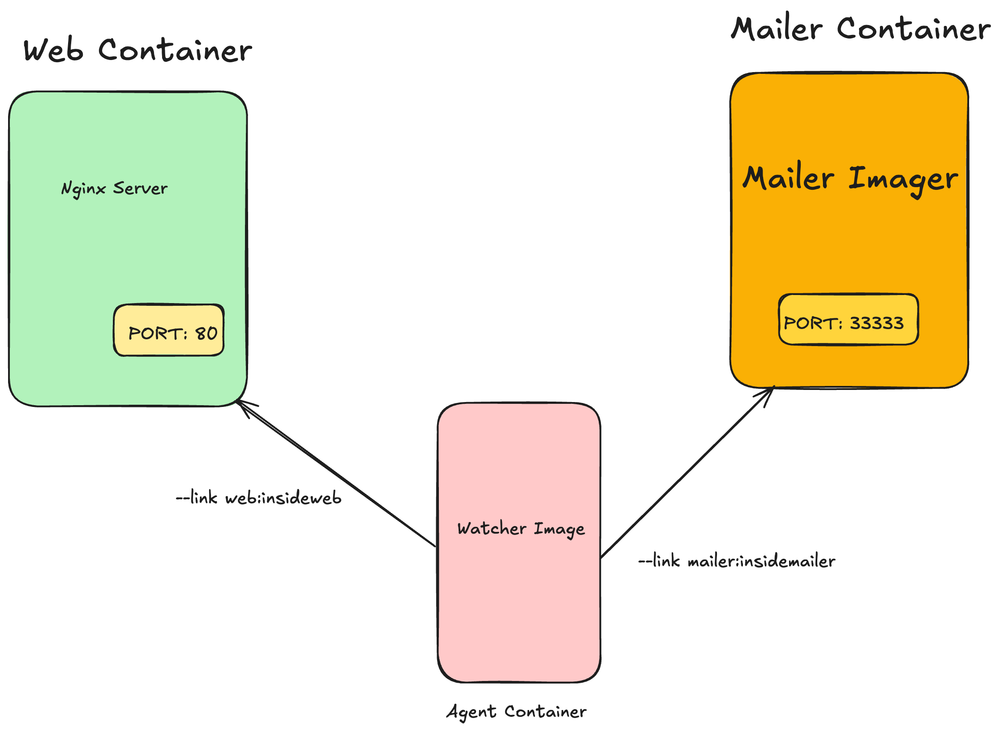

# monitored_nginx_docker
# Scenario Overview



```sh
docker run -d --name web nginx:latest
mkdir mailer
cd mailer
```
Create the ```mailer.sh``` script:
```
touch mailer.sh
```
Edit the ```mailer.sh``` script:
```sh

#!/bin/sh
printf "CH2 Example Mailer has started.\n"
while true
do
        MESSAGE=`nc -l -p 33333`
        printf "Sending email: %s\n" "$MESSAGE"
	sleep 1
done
```

Create the ```Dockerfile```:

```sh
touch Dockerfile
```

```sh
FROM busybox
COPY . /mailer
WORKDIR /mailer

RUN adduser -DHs /bin/bash example

RUN chown example mailer.sh
RUN chmod a+x mailer.sh
EXPOSE 33333

USER example
CMD ["/mailer/mailer.sh"]

```
Build and Run the following command to build your Docker image:

```sh
docker build -t mailer-image .
docker run -d --name mailer mailer-image
```
Run an interactive container linked to the web container to verify the ```web``` server:
```sh
docker run --interactive --tty --link web:web --name web_test busybox:latest /bin/sh
```
Test 
```wget -O - http://web:80/```

Create a directory to store your ```watcher.sh``` script and Dockerfile.

```sh
mkdir watcher
cd watcher
touch watcher.sh

#!/bin/sh
while true
do
        if `printf "GET / HTTP/1.0\n\n" | nc -w 2 $INSIDEWEB_PORT_80_TCP_ADDR $INSIDEWEB_PORT_80_TCP_PORT | grep -q '200 OK'`
        then
		echo "System up."
        else 
        	printf "To: admin@work  Message: The service is down!" | nc $INSIDEMAILER_PORT_33333_TCP_ADDR $INSIDEMAILER_PORT_33333_TCP_PORT
                break
	fi

	sleep 1
done

```
This script checks if the web server is up by sending a GET request to it. If the server is down, it sends an email notification.

Create the Dockerfile for the watcher container:
```sh
touch Dockerfile
```
Edit the ```Dockerfile``` and add the following content:

```sh
FROM busybox
COPY . /watcher
WORKDIR /watcher

RUN adduser -DHs /bin/bash example
RUN chown example watcher.sh
RUN chmod a+x watcher.sh
USER example

CMD ["/watcher/watcher.sh"]
```
This ```Dockerfile``` creates a new user, copies the watcher script, sets the permissions, and sets the default command to run the script.

Then, run the following command to build your Docker image:

```sh
docker build -t watcher-image .
docker run -it --name agent --link web:insideweb --link mailer:insidemailer watcher-image
```
This command builds a Docker image with the name watcher-image.

Monitor the NGINX server.
Print "System up." if the server is running.
Trigger the mailer to send an email if the server goes down.

Check which containers are running:

```sh 
docker ps
```

Restart Containers

```sh
docker restart web
docker restart mailer
docker restart agent
```
View Container Logs
Examine logs to ensure everything is running correctly:

```sh
docker logs web
docker logs mailer
docker logs agent
```
Web Logs: Look for "GET / HTTP/1.0" 200 to confirm the agent is testing the web server.
Mailer Logs: Ensure the mailer has started.
Agent Logs: Confirm "System up." messages indicating the server is running.
Step 8: Follow Logs
To continuously monitor logs, use the --follow flag:

docker logs -f agent
Press Ctrl + C to stop following the logs.

Step 9: Test the System
Stop the web container to test the monitoring system:

```sh 
docker stop web
```
Check the mailer logs to see if it recorded the service down event and triggered an email notification:

```sh 
docker logs mailer
```

Look for a line like:

```Sending email: To: admin@work Message: The service is down!```


